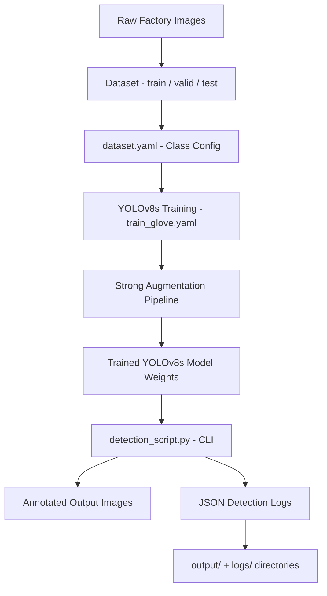

# Glove Compliance Detection — Gloved vs Bare Hands

End-to-end YOLOv8s object detection pipeline for factory glove compliance monitoring. Detects gloved and ungloved hands in factory images, outputs annotated images, and emits structured JSON logs per detection.

**Engineering concept:** Custom YOLOv8 object detection training, industrial safety computer vision, CLI inference pipeline with structured JSON output.

## Architecture

## Tech Stack

| Layer         | Technology                   |
| ------------- | ---------------------------- |
| Language      | Python 3.x                   |
| Model         | YOLOv8s (Ultralytics)        |
| Framework     | PyTorch                      |
| GPU Support   | CUDA (optional)              |
| Config Format | YAML                         |
| Output        | Annotated images + JSON logs |

## Project Structure

├── Part_1_Glove_Detection/  
│   ├── detection_script.py     # CLI inference script  
│   ├── output/                 # Annotated output images  
│   ├── logs/                   # JSON detection logs  
│   └── README.md               # Part 1 detailed notes  
├── Part_2_Answers.pdf          # Reasoning write-up  
├── dataset/  
│   ├── train/  
│   │   ├── images/  
│   │   └── labels/  
│   ├── valid/  
│   │   ├── images/  
│   │   └── labels/  
│   └── test/  
│       ├── images/  
│       └── labels/  
├── dataset.yaml                # Dataset class configuration  
├── train_glove.yaml            # YOLOv8 training configuration  
├── requirements.txt  
└── README.md  

## How the System Works

1. Dataset is organized into train / valid / test splits with YOLO-format labels
2. dataset.yaml defines class names: gloved_hand, bare_hand
3. train_glove.yaml configures YOLOv8s training: epochs, image size, augmentations
4. Model is trained with strong augmentations to handle factory lighting variation
5. detection_script.py runs CLI inference on new images
6. Each detection produces an annotated image and a JSON log entry

## How to Run Locally

git clone https://github.com/Jagmohan-Prajapati/Gloved-vs-Ungloved-Hand-Detection.git  
cd Gloved-vs-Ungloved-Hand-Detection  

Create virtual environment  
python -m venv .venv  
.venv\Scripts\Activate.ps1        # Windows PowerShell  
source .venv/bin/activate        # macOS / Linux  

Install dependencies  
pip install --upgrade pip  
pip install -r requirements.txt  

If using NVIDIA GPU - install CUDA-matched PyTorch first  
then re-run: pip install -r requirements.txt  

### Train the Model

yolo task=detect mode=train model=yolov8s.pt data=dataset.yaml cfg=train_glove.yaml

### Run Inference

cd Part_1_Glove_Detection  
python detection_script.py --source path/to/image.jpg

## Example Output

Image: factory_floor_042.jpg

Detection 1:  
  class: gloved_hand  
  confidence: 0.94  
  bbox:   

Detection 2:  
  class: bare_hand  
  confidence: 0.89  
  bbox:   

JSON log saved to: logs/factory_floor_042.json  
Annotated image saved to: output/factory_floor_042_annotated.jpg  
  
